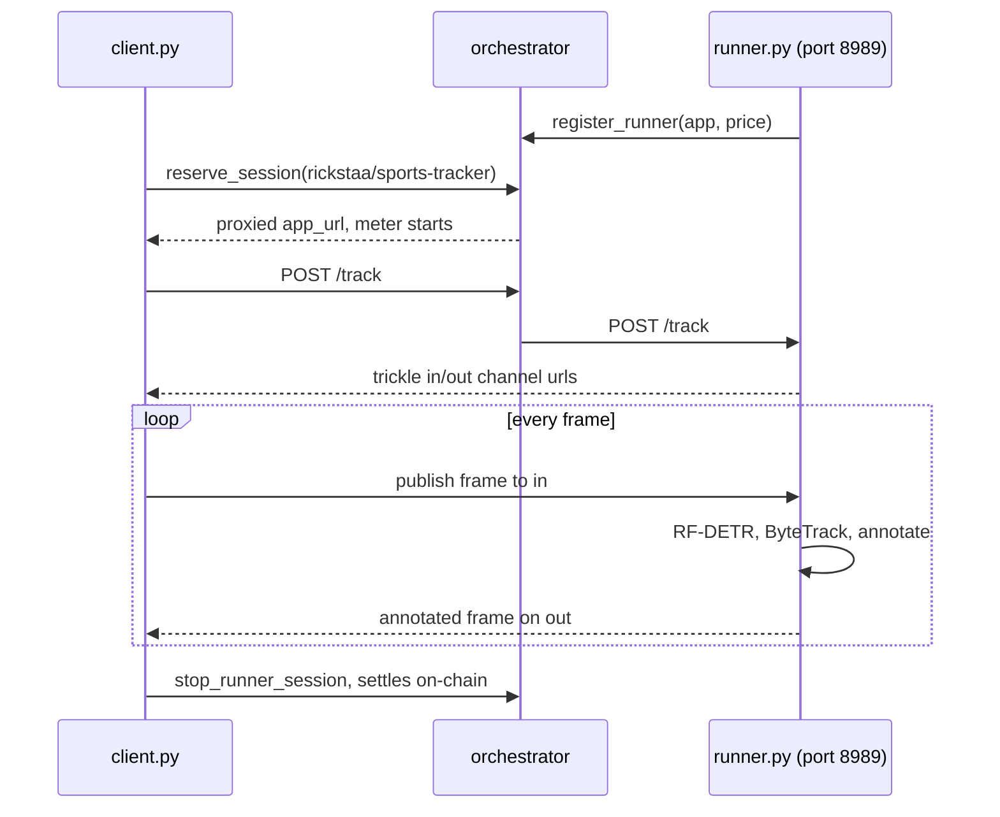

# sports-tracker-livepeer-runner

Realtime player and ball tracking on the **Livepeer network**: stream a match in over trickle channels and get it back with the signature sports overlay — an ellipse under each player, a marker over the ball, stable id labels, and movement traces. `teams` mode colour-codes the two sides by jersey.

Detection is **RF-DETR** (Roboflow, Apache-2.0), tracking is **`supervision`** ByteTrack (MIT), and the whole thing self-registers with an orchestrator over the SDK. Unlike a static runner, the app is stateful: the tracker and its trickle channels live for the length of a session.

```sh
docker compose up -d --build
uv run client.py --mode teams clip.mp4        # writes sports-tracker-out.ts
```

|              |                                      |
| ------------ | ------------------------------------ |
| App id       | `rickstaa/sports-tracker`            |
| Runner mode  | persistent (held-open session)       |
| Registration | dynamic (self-registers via the SDK) |
| Transport    | trickle (realtime video in/out)      |
| Pricing      | hour (metered per second while held) |
| Port         | 8989                                 |

**Requires an NVIDIA GPU.** RF-DETR is a detection transformer, so a GPU is the point. You also need **Docker** (with the [NVIDIA container toolkit](https://docs.nvidia.com/datacenter/cloud-native/container-toolkit/latest/install-guide.html)) and [**uv**](https://docs.astral.sh/uv/).

## How it's wired

The app is **dynamically registered**: [runner.py](runner.py) announces itself to the orchestrator with `register_runner`, rather than being named in the orchestrator's config. That is the right shape for a stateful live app — a tracker holding player ids across frames cannot be a stateless request handler.

It exposes two ordinary HTTP handlers, both reverse-proxied through the orchestrator:

| Endpoint      | Does                                                            |
| ------------- | --------------------------------------------------------------- |
| `POST /track` | start a session and open the trickle `in` / `out` channels       |
| `POST /update`| switch mode mid-stream, without dropping the session             |

Grep `# Livepeer:` in either file for the calls. In [runner.py](runner.py):

1. `register_runner` — announce the app at startup, with its price.
2. `create_trickle_channels` — open the session's `in` / `out` channels.
3. `registration.close()` — deregister on shutdown.

And in [client.py](client.py): `reserve_session` → `MediaPublish` / `MediaOutput` → `stop_runner_session`.

Per frame the runner runs RF-DETR, updates a `supervision` ByteTrack tracker so player ids survive across frames, and draws the overlay. `teams` mode additionally k-means clusters torso colour into two sides.



## Models and modes

`--size` picks the RF-DETR variant, all Apache-2.0. Bigger is more accurate and slower:

| Size     | COCO AP | Latency (T4) |
| -------- | ------- | ------------ |
| `nano`   | 48.4    | 2.3 ms       |
| `small`  | 53.0    | 3.5 ms       |
| `medium` | 54.7    | 4.4 ms       |
| `large`  | 56.5    | 6.8 ms       |

`medium` is the default and the weights are baked into the image, so nothing downloads at runtime. The COCO classes used are **person** and **sports ball**, resolved by name rather than index so a fine-tuned checkpoint passed with `--weights` keeps working.

Two modes, switchable mid-stream with `POST /update`:

- `track` — one colour for every player, plus ids and traces.
- `teams` — the two sides colour-coded by jersey.

## Run offchain (free)

No wallet, no funds.

```sh
docker compose up -d --build
uv run client.py --mode teams clip.mp4
```

The client reads a file or stdin and writes MPEG-TS, so it chains:

```sh
ffmpeg -re -i clip.mp4 -f mpegts - | uv run client.py --output - | ffplay -i -
```

`--max-frames` caps a run, which is handy for a quick smoke test. Then:

```sh
docker compose down
```

## Run on-chain (paid)

Layer the overlay to add a remote signer and put the orchestrator on-chain, so the held session is metered and paid per second. Beyond the offchain prerequisites you need an **Ethereum RPC**, a **signer wallet** with a deposit and reserve, an **orchestrator wallet** with ETH for gas, and both keystores as directories **outside this repo**, mounted read-only.

```sh
cp .env.example .env   # RPC, network, keystore paths, accounts, price, price cap
docker compose -f compose.yml -f compose.onchain.yml up -d --build
uv run client.py --mode teams clip.mp4 --signer http://localhost:7936
docker compose -f compose.yml -f compose.onchain.yml down
```

The price comes from the app's own registration (`--price`, USD per hour), not from orchestrator config, because this runner registers dynamically. Keep demo sessions short — the meter runs for as long as the session is held.

> [!WARNING]
> The signer runs with `-remoteSignerAllowNoAuth`, which signs for anyone who can reach it and spends your deposit. That is fine on a laptop and wrong anywhere else: authorize callers with `-remoteSignerWebhookUrl` before exposing it.

## Ship it to an orchestrator

CI publishes the image to `ghcr.io/rickstaa/sports-tracker-livepeer-runner` on `main` and `v*` tags. Tags: `latest` (current `main`), `stable` (latest `v*` release), `1.2` / `1.2.3`, `sha-<short>`. The package is public, so pulling needs no account and no login.

`docker compose up` always builds from source. To run the published image instead:

```sh
docker compose up -d --pull always
```

## Development

```sh
uvx pre-commit install      # format on commit
uvx pre-commit run --all-files
```

CI runs the same hooks, checks the compose files parse, and builds the image.

## License and attribution

This repo is an **example** of how to run realtime video tracking on the [live runner](https://github.com/livepeer/go-livepeer/blob/master/doc/live-runner.md), not a production-ready pipeline. The code here ([runner.py](runner.py), [client.py](client.py), the compose files) is MIT.

The image is **permissively licensed end to end**, which was a deliberate choice:

| Component            | Licence    |
| -------------------- | ---------- |
| RF-DETR (detector)   | Apache-2.0 |
| `supervision`        | MIT        |
| PyTorch              | BSD-3      |
| this wrapper         | MIT        |

The obvious alternative, Ultralytics YOLO, is **AGPL-3.0**. AGPL §13 covers network interaction, and a Livepeer runner is network-interaction software by definition, so an orchestrator running such an image commercially would inherit a source-disclosure obligation. RF-DETR avoids that and is also the stronger model: RF-DETR Large reaches 56.5 COCO AP at 6.8 ms, against YOLOv11x at 50.9 AP and higher latency.

Fine-tuned checkpoints you pass with `--weights` carry their own licences — [Roboflow Universe](https://universe.roboflow.com) models are per-dataset, so check before redistributing one.

## Building your own

Start from [**template-livepeer-runner**](https://github.com/livepeer/template-livepeer-runner), then list yours in [**runner-app-examples**](https://github.com/livepeer/runner-app-examples#external-examples). That repo has a minimal example of each transport, mode, registration, and pricing option; the [live runner docs](https://github.com/livepeer/go-livepeer/blob/master/doc/live-runner.md) are the reference.
